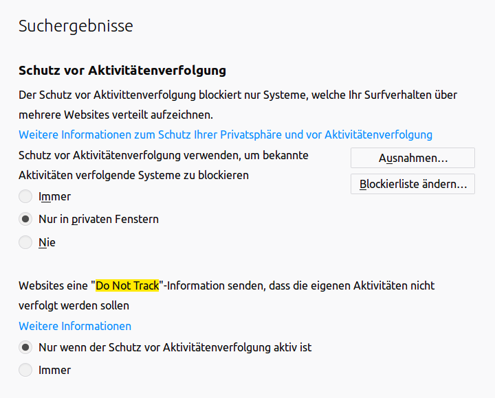

## Privacy documenation

First of all let your visitors know what kind of information you are collecting and why you are collection those
information.

### Tracking Opt Out

As known from Matomo (former known as Piwik) also Lux offers a Plugin fo an Opt-Out possibility for visitors.

#### DoNotTrack Header

Browsers support a (per default turned off) option to inform the website that the visitor don't wants to be tracked.
This is the *DoNotTrack* or *DNT* setting. Even if this rare used feature of the browser is only a recommendation, Lux
will respect this setting of course!

**Note:** While Firefox turns on the DNT by default for anonymous tabs, Chrome and Internet Explorer never turn this
setting on by default.
