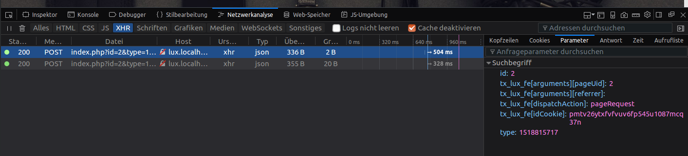
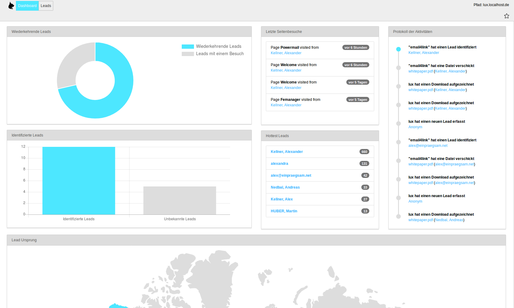

### Analysis

This part of the documentation describes all configuration parts related to analysis and tracking of visitors.

#### TypoScript Configuration

The file [01_TrackingConfiguration.typoscript](../../../Configuration/TypoScript/Lux/01_TrackingConfiguration.typoscript)
contains all relevant settings for the visitor tracking.

Lux basicly tracks every vistors page request with the current time. In addition it's possible to also track asset
downloads.

See the inline comments for a description in TypoScript:

```
lib.lux.settings {

    # All tracking settings
    tracking {
        pagevisits {
            # Toggle pagevisit tracking (on/off).
            # Switching this feature on will flood table tx_lux_domain_model_pagevisit but allow you to see a full pagefunnel of all of your visitors. Your decision :)
            _enable = {$plugin.tx_lux.settings.tracking.page}
        }
        assetDownloads {
            # Toogle asset download tracking (on/off)
            _enable = {$plugin.tx_lux.settings.tracking.assetDownloads}

            # Allow only files with this extensions
            allowedFileExtensions = {$plugin.tx_lux.settings.tracking.assetDownloads.allowedExtensions}
        }
    }
}
```

Constants to this TypoScript part:
```
plugin.tx_lux.settings {
    # cat=lux//0010; type=boolean; label= Activate page tracking: (De)Activate tracking of the users pagefunnel.
    tracking.page = 1

    # cat=lux//0020; type=boolean; label= Activate download tracking: (De)Activate tracking if the user downloads an asset.
    tracking.assetDownloads = 1

    # cat=lux//0020; type=text; label= Activate download tracking: (De)Activate tracking if the user downloads an asset.
    tracking.assetDownloads.allowedExtensions = pdf,txt,doc,docx,xls,xlsx,ppt,pptx,jpg,png,zip
}
```

Example page tracking request in browser console:


### Backend Module Analysis

Now, if lux is up and running, you should see information in the Analysis Backend Module in the dashboard view:

