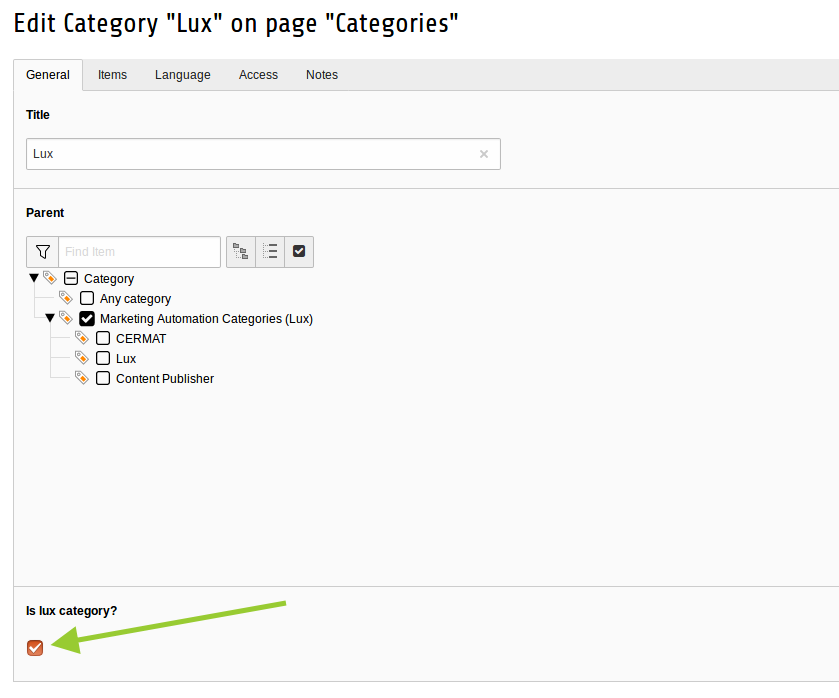
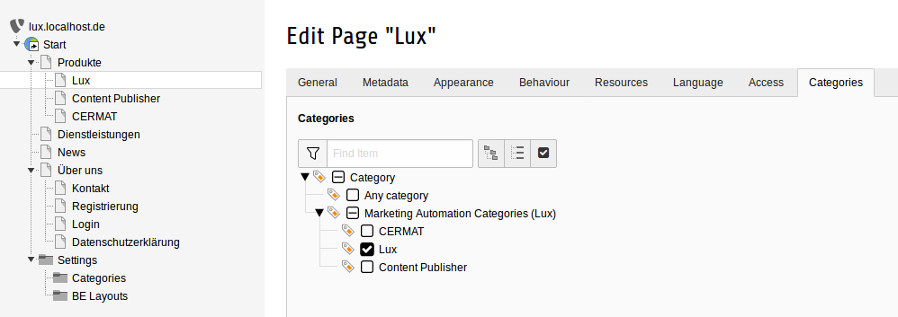
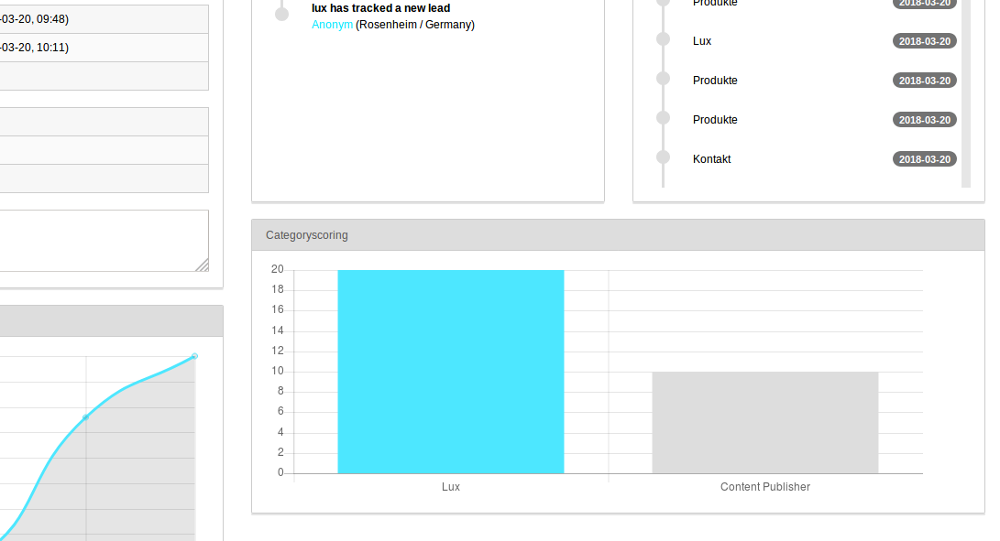

### Categoryscorings

#### Configuration

While scoring tells us how hot a lead is, category scoring will tell us which product/service is the right choice for
different leads (see glossary at [Marketing Information](../../Marketing/Index.md)).

You can simple define some lux-categories in your TYPO3. A lux-category is just a sys_category record in TYPO3.
Don't forget to check the checkbox "lux-category".

After you added some lux-categories to your system, you can mark pages and files with that categories.

#### Calculation

Per default every visit of a page of a lux-category will increase category-scoring with factor 10 while a download will
increase the value by 20 (a download is a larger action then a simple pagevisit - this results in more scoring points
of course).

If you want to change the factors, you can do this in the Extension Manager in the settings of lux (see part
[Installation](../Installation/Index.md)).

#### Analysis

Just open a lead detail-view. You will see all relevant information about category scorings to this lead.

