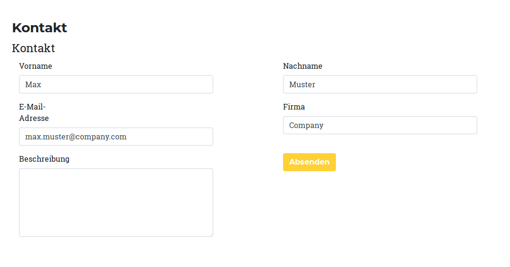
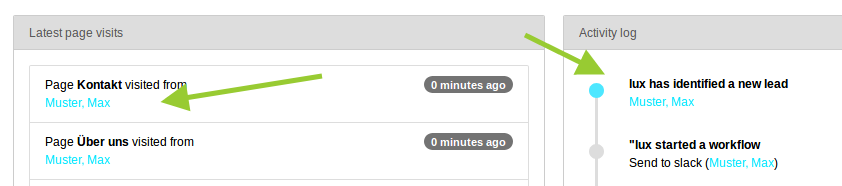

### Identification

This part of the documentation describes different possibilities to identify your leads. Identification means that you
are able to know the person behind the lead. Identification needs an unique identification-property from the lead.
E.g. firstname would be - of course - not a good property because this is not unique.
Marketing Automation tools are going to use the **email-address** as unique property of the user.
And... emails are great because, you can:

* identify the lead
* see the firstname as part of the email address (mostly given in business cases)
* see the lastname as part of the email address (mostly given in business cases)
* see the company as part of the email address (mostly given in business cases)
* having an url (company) where you can simply find more interesting stuff of your lead
* send marketing relevant information in newsletters

#### Field mapping

The easiest way for an identification is to offer some forms on your website where you listen to the values that your
visitors add there. Lux will help you to listen on any webform (no matter if it is powermail, femanager, form,
formhandler, felogin or a static html content). The technique behind is simple. You can map field names to lead
properties via TypoScript.

The default mapping will e.g. map a field with name `tx_powermail_pi1[field][e-mail]` to the lead property *email*
(see TypoScript below).

```
lib.lux.settings {

    # All identification settings
    identification {
        # En- or Disable field identification
        _enable = {$plugin.tx_lux.settings.fieldidentification}

        # Auto identify with EVERY input field of your website.
        # Using a * as wildcard will search for a string in a string while using a key without * will search for the exact match.
        fieldMapping {
            # "email" is the key-field for visitor identification and merging.
            email {
                0 = *[email]
                1 = *[e-mail]
                2 = *[e_mail]
            }
            firstname {
                0 = *[firstname]
                1 = *[first-name]
                2 = *[first_name]
                3 = *[firstName]
                4 = *[vorname]
            }
            lastname {
                0 = *[lastname]
                1 = *[last-name]
                2 = *[last_name]
                3 = *[lastName]
                4 = *[surname]
                5 = *[sur-name]
                6 = *[sur_name]
                7 = *[name]
                8 = *[nachname]
            }
            company {
                0 = *[company]
                1 = *[firma]
            }
            phone {
                0 = *[phone]
                1 = *[telefon]
                2 = *[tel]
            }
            username {
                0 = username
                1 = user
                2 = benutzername
                3 = benutze
            }
        }
    }
}

```

You can test the field mapping by adding a simple form to your frontend. Open a second browser and fill out the form.
As soon as you enter an email and leave the field (on blur), the values are sent asynchronical to Lux. You don't have to
submit the form. Just go into the backend and check if the lead gets identified.

Example powermail form in frontend:


Example lead identification in dashboard:

