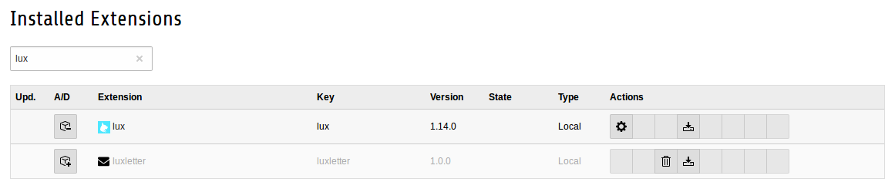

### Installation

#### Requirements

* TYPO3 8.7 or newer
* TYPO3 should use the composer mode
* PHP 7.0 - 7.2

#### Installation via composer

Example composer.json file:

```
{
  "require": {
    "php": ">=7.0.0 <7.3.0",
    "typo3/cms": "^8.7",
    "in2code/lux": "^1.0",
  },
  "repositories": [
    {
      "type": "composer",
      "url": "https://composer.typo3.org"
    },
    {
      "type": "git",
      "url": "git@github.com:in2code-de/lux.git"
    }
  ]
}
```

After you have added the repository and the package name, you can do a `composer update in2code/lux` for example to
install the package. Don't forget to activate (e.g. in the extension manager) the extension once it is installed.

**Note:** You need a github user that has access to the private lux repository for an installation.

**Note:** Lux itself will also load the php package [jlawrence/eos](https://packagist.org/packages/jlawrence/eos) for
some scoring calculation magic.

#### Extension Manager settings



If you click on the settings symbol for extension lux, you can change some basic settings in lux extension.


#### Add TypoScript

If you have already activated lux in your TYPO3 instance, you can add the static TypoScript file *Main TypoScript (lux)*
in your root template. Most of the TypoScript configuration is used for frontend and for backend configuration.

If you want to see what kind of TypoScript will be included and how to overwrite some parts, look at
[the Lux folder](../../../Configuration/TypoScript/Lux)
