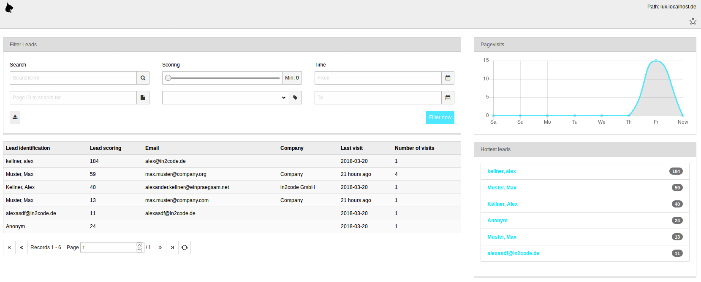
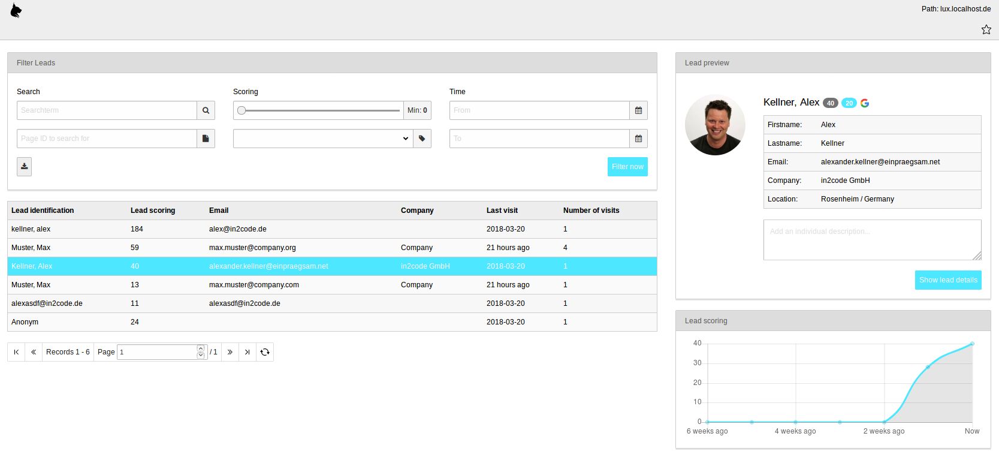

### Backend Module Leads

The backend module Leads show you all identified (and anonymous) leads.

See all your leads in a listview on the left side while you can see useful lead information on the right side
(number of page visits and hottest leads). The left side itself is splitted into a filter area and the table-list-view
below.

#### Filter

| Field                     | Description                                                                                                              |
| ------------------------- | ------------------------------------------------------------------------------------------------------------------------ |
| Searchterm                | Use this fulltext search field for filtering (name, email, company, cookieId, etc...)                                    |
| Page ID                   | Show only leads that visited a page (Table columns change - pagevisits available now)                                    |
| Scoring                   | Search for leads with a minimum scoring                                                                                  |
| Category-Scoring          | Show only leads that have a category-scoring of a given category (Table columns change - Categoryscoring will be available) |
| Time-From                 | Search for leads that are only known since a defined date and time                                                       |
| Time-To                   | Search for leads that are only active until a defined date and time                                                      |

**Filter Buttons**
Filter now: Let's filter the table with our properties
Reset filter: Let's reset the table to original list view
Download button: The download button let you download the lead table in format CSV

#### Table

The table will show you your website leads.

| Column                    | Description                                                                                                              |
| ------------------------- | ------------------------------------------------------------------------------------------------------------------------ |
| Lead identification       | Use this fulltext search field for filtering (name, email, company, cookieId, etc...)                                    |
| Lead scoring              | Show only leads that visited a page (Table rows change - pagevisits available now)                                       |
| Email                     | Search for leads with a minimum scoring                                                                                  |
| Company                   | Show only leads that have a category-scoring of a given category (Table rows change - Categoryscoring will be available) |
| Last visit                | Search for leads that are only known since a defined date and time                                                       |
| Number of visits          | Search for leads that are only active until a defined date and time                                                      |
| Pagevisits                | Only viewable if you filter for a page (will replace column *Number of visits*)                                          |
| Categoryscoring           | Only viewable if you filter for a scoring of a category                                                                  |

**Orderings:** Per default the orderings is identified leads first and after that sort by scoring. The orderings can
be change if you are using a special filter.

#### Detail Preview

If you click in a table row, a small lead preview will be loaded via AJAX. Both diagrams on the right side will be
replaced with a preview box and a scoring box.

If you add a text into the textarea *Add an individual description*, this notice is saved automaticly if the focus gets
lost on the field (on blur).

Clicking on *Show lead details* will open the detail page.

#### Detail View

The detail view will give you a couple of information of the chosen lead.

