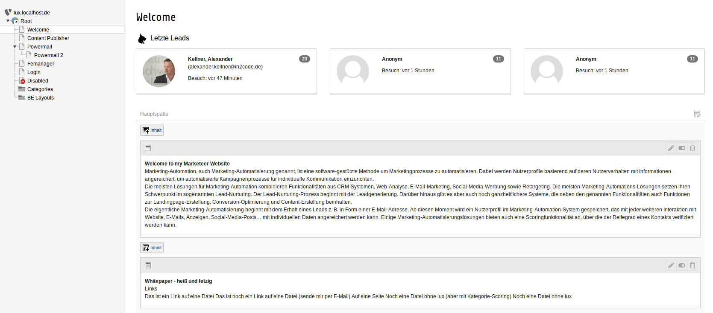
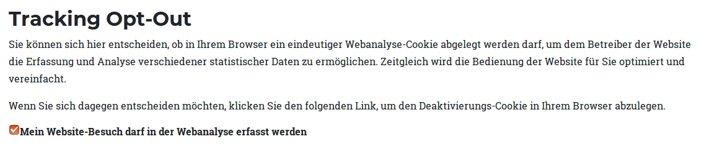
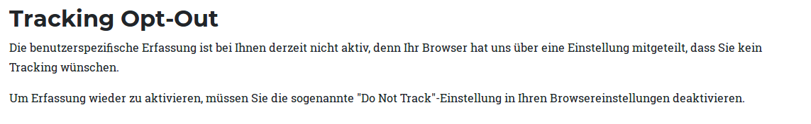
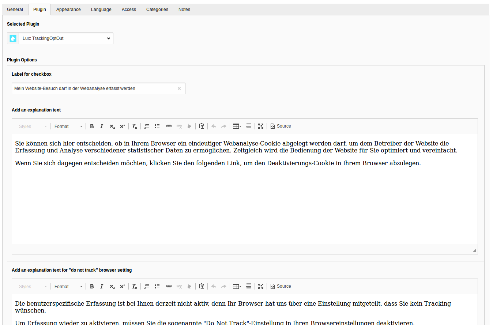

### Plugins and Pageoverview

This part of the documentation describes all lux plugins and the pageoverview view in backend.

#### Pageoverview

If you have activated pageoverview in Extension Manager settings of extension lux, you will see the last three
leads (Identified and Anonymous) of a page in page module.

#### Plugins

##### Plugin 1: Opt out

The first plugin in lux fits ideally to your privacy notes page. As you may not from Matomo (former known as Piwik) Lux
also offers a checkbox in frontend where visitors can de-check if they don't want to be tracked.

If the browser has a *DoNotTrack* setting enabled, the view changes a bit.

You can simply add a Plugin Pi1 *trackingOptOut* to a page and add some content to it.

