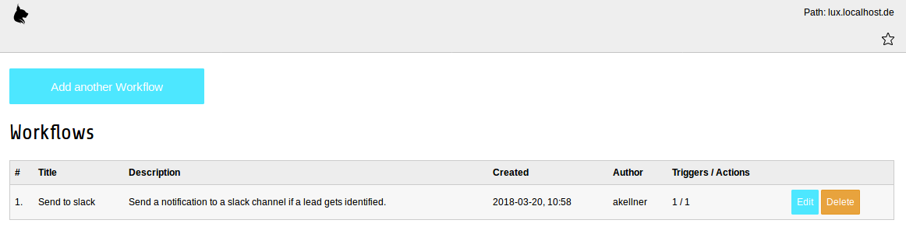
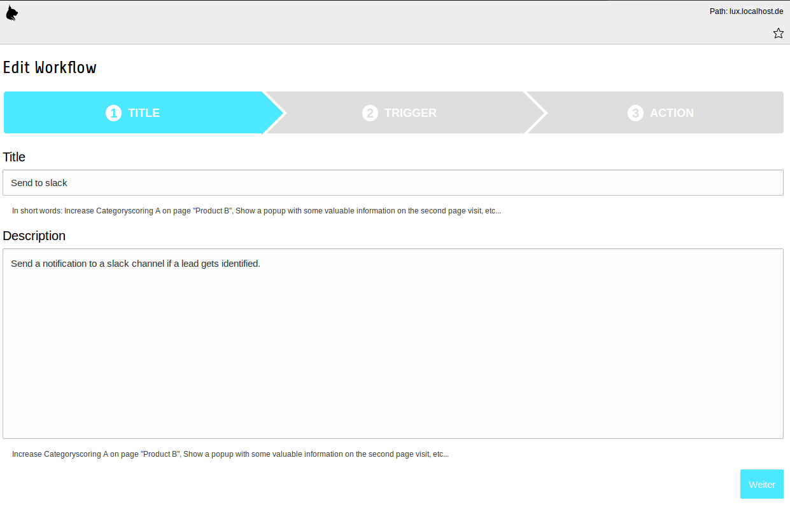
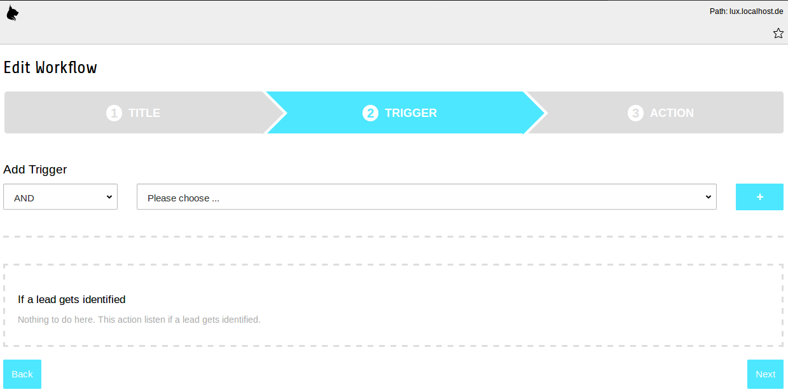
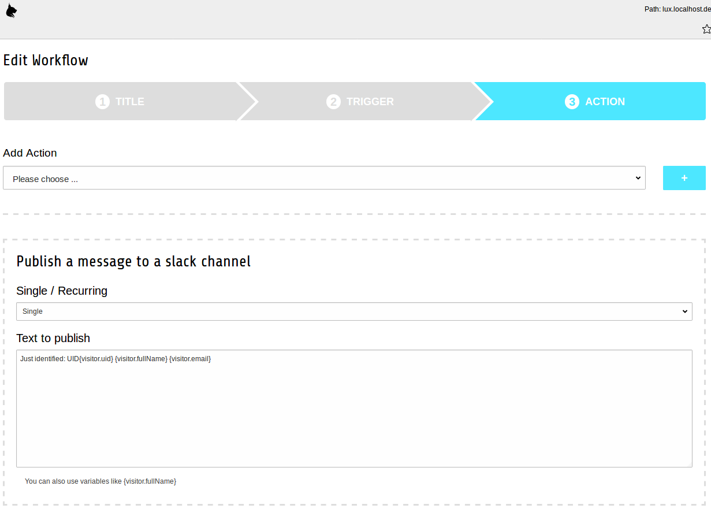

### Backend Module Workflows

This part of the manual describes how to manage workflows in lux backend module.

A workflow is a technique to nurture your leads. Let's say a lead that reaches a category scoring of 25 in a category
*Product A* should see a special offer in a popup (lightbox)? Or maybe you want to redirect a lead to a different page
if he/she visits the page the second time? Lux will help you to build your own and individual workflows.

#### List view

If you open the backend module workflows and you have not added any workflows yet, the only interaction possibility for
you is to add a new workflow. If you have already added one or more workflows, you will see a list of your existing
workflows.



Existing workflows can be deleted or edited by clicking the buttons.
If you edit an existing workflow or if you add a new workflow, you will see a form that is splitted into three
different steps.

#### 1 Title

Define a title and an internal description for your new workflow:


After that you can choose next for step 2.

#### 2 Trigger

A trigger is an event that happens. You can choose one or more triggers (and combine them logical with AND or OR) that
should result in an action (see 3 Action).

Choose a trigger and click on the **+** button. Now a new trigger configuration was added. Depending on the trigger that
you have chosen, it's possible to add values to the trigger itself. In this example, we choose the *If a lead gets
identified* trigger - no values to add here:


Possible triggers by default are:
* On entering a page
* When lead reaches a scoring
* When lead reaches a categoryscoring
* When lead enters a page of a given category
* On a defined time
* If a lead gets identified

After that you can choose next for step 3 or previous for step 1 again.

#### 3 Action

An action is when lux executes a workflow on given conditions (triggers). You can choose one or more actions.
If you choose more actions, all actions will be executed.

Choose an action and click on the **+** button. Now a new action configuration was added. Depending on the action that
you have chosen, it's possible to add values to the action itself. In this example, we choose the *Publish a message
to a slack channel* action.

We can select if this action should be executed only once (default setting) or multiple times
and we can add a text for publishing to a slack channel.



Possible actions by default are:
* Open a popup (lightbox) with a content element
* Redirect visitor to another page
* Sends an email
* Publish a message to a slack channel

After that you can choose save or previous for step 2 again.

#### TypoScript Configuration

There is a default TypoScript configuration that will be added if you add the Lux Static Template to your root template.
Depending on the triggers and actions that you're using, you can enrich some of them with configuration in TypoScript.
If you want to publish to a slack channel, a webhook URL is needed e.g.


```
lib.lux.settings {

    # All workflow settings
    workflow {

        ############################
        # Define individual triggers
        ############################
        triggers {

            # Trigger if visitor enter a page
            1 {
                # Title to show in workflow backend module
                title = LLL:EXT:lux/Resources/Private/Language/locallang_db.xlf:trigger.pagevisit

                # Classname for implementation of the trigger itself
                className = In2code\Lux\Domain\Trigger\PageVisitTrigger

                # Templatefile for implementation of the form in workflow module
                templateFile = EXT:lux/Resources/Private/Templates/Workflow/Trigger/PageVisit.html

                # Additional configuration
                configuration {
                    # Any configuration - available as array in Template File and Trigger class for some own magic
                }
            }

            # Trigger for reached scoring
            2 {
                # Title to show in workflow backend module
                title = LLL:EXT:lux/Resources/Private/Language/locallang_db.xlf:trigger.scoring

                # Classname for implementation of the trigger itself
                className = In2code\Lux\Domain\Trigger\ScoringTrigger

                # Templatefile for implementation of the form in workflow module
                templateFile = EXT:lux/Resources/Private/Templates/Workflow/Trigger/Scoring.html

                # Additional configuration
                configuration {
                    # Any configuration - available as array in Template File and Trigger class for some own magic
                }
            }

            # Trigger for reached categoryscoring
            3 {
                # Title to show in workflow backend module
                title = LLL:EXT:lux/Resources/Private/Language/locallang_db.xlf:trigger.categoryscoring

                # Classname for implementation of the trigger itself
                className = In2code\Lux\Domain\Trigger\CategoryScoringTrigger

                # Templatefile for implementation of the form in workflow module
                templateFile = EXT:lux/Resources/Private/Templates/Workflow/Trigger/CategoryScoring.html

                # Additional configuration
                configuration {
                    # Any configuration - available as array in Template File and Trigger class for some own magic
                }
            }

            # If lead enters a page or downloads an asset with a relation to a lux category
            4 {
                # Title to show in workflow backend module
                title = LLL:EXT:lux/Resources/Private/Language/locallang_db.xlf:trigger.category

                # Classname for implementation of the trigger itself
                className = In2code\Lux\Domain\Trigger\CategoryTrigger

                # Templatefile for implementation of the form in workflow module
                templateFile = EXT:lux/Resources/Private/Templates/Workflow/Trigger/Category.html

                # Additional configuration
                configuration {
                    # Any configuration - available as array in Template File and Trigger class for some own magic
                }
            }

            # Trigger for a defined time (start to stop)
            5 {
                # Title to show in workflow backend module
                title = LLL:EXT:lux/Resources/Private/Language/locallang_db.xlf:trigger.timeframe

                # Classname for implementation of the trigger itself
                className = In2code\Lux\Domain\Trigger\TimeFrameTrigger

                # Templatefile for implementation of the form in workflow module
                templateFile = EXT:lux/Resources/Private/Templates/Workflow/Trigger/TimeFrame.html

                # Additional configuration
                configuration {
                    # Any configuration - available as array in Template File and Trigger class for some own magic
                }
            }

            # Trigger lead gets identified
            6 {
                # Title to show in workflow backend module
                title = LLL:EXT:lux/Resources/Private/Language/locallang_db.xlf:trigger.identified

                # Classname for implementation of the trigger itself
                className = In2code\Lux\Domain\Trigger\IdentifiedTrigger

                # Templatefile for implementation of the form in workflow module
                templateFile = EXT:lux/Resources/Private/Templates/Workflow/Trigger/Identified.html

                # Additional configuration
                configuration {
                    # Any configuration - available as array in Template File and Trigger class for some own magic
                }
            }
        }


        ###########################
        # Define individual actions
        ###########################
        actions {

            # Action for showing an individual content element in a lightbox to the lead
            1 {
                # Title to show in workflow backend module
                title = LLL:EXT:lux/Resources/Private/Language/locallang_db.xlf:action.popupcontentelement

                # Classname for implementation of the action itself
                className = In2code\Lux\Domain\Action\PopupContentElementAction

                # Templatefile for implementation of the form in workflow module
                templateFile = EXT:lux/Resources/Private/Templates/Workflow/Action/PopupContentElement.html

                # Additional configuration
                configuration {
                    # Any configuration - available as array in Template File and Action class for some own magic
                }
            }

            # Action for doing a redirect to another URI
            2 {
                # Title to show in workflow backend module
                title = LLL:EXT:lux/Resources/Private/Language/locallang_db.xlf:action.redirect

                # Classname for implementation of the action itself
                className = In2code\Lux\Domain\Action\RedirectAction

                # Templatefile for implementation of the form in workflow module
                templateFile = EXT:lux/Resources/Private/Templates/Workflow/Action/Redirect.html

                # Additional configuration
                configuration {
                    emailOverrides {
                        # Any configuration - available as array in Template File and Action class for some own magic
                    }
                }
            }

            # Action for sending a notification email
            3 {
                # Title to show in workflow backend module
                title = LLL:EXT:lux/Resources/Private/Language/locallang_db.xlf:action.email

                # Classname for implementation of the action itself
                className = In2code\Lux\Domain\Action\EmailAction

                # Templatefile for implementation of the form in workflow module
                templateFile = EXT:lux/Resources/Private/Templates/Workflow/Action/Email.html

                # Additional configuration
                configuration {
                    emailOverrides {
                        # Override sender settings for SPF-defiance settings (affected only the sender settings - not the reply to settings)
                        senderName = Marketing
                        senderEmail = service@domain.org
                    }
                }
            }

            # Action for publishing to a slackchannel
            4 {
                # Title to show in workflow backend module
                title = LLL:EXT:lux/Resources/Private/Language/locallang_db.xlf:action.slack

                # Classname for implementation of the action itself
                className = In2code\Lux\Domain\Action\SlackAction

                # Templatefile for implementation of the form in workflow module
                templateFile = EXT:lux/Resources/Private/Templates/Workflow/Action/Slack.html

                # Additional configuration
                configuration {
                    # Add your webhook Url like https://hooks.slack.com/services/token
                    webhookUrl = https://hooks.slack.com/services/TOKENabcdefghi56789/67890p789/7890

                    # Username for this webhook
                    username = lux

                    # Set an emoji for all this publishings (can be empty, if you already set an image to your webhook in slack)
                    emoji = :fire:
                }
            }
        }
    }
}
```

#### Extending Triggers and Actions

Of course we wanted to build a very flexible Marketing Automation tool that can be extended to your needs. So we don't
know all the triggers and actions that you need. But we made it very easy for you to extend the existing list with your
own triggers and actions.
