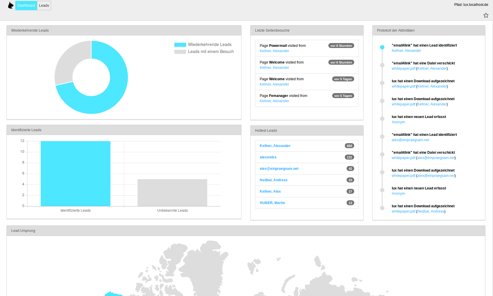

# Living User eXperience - LUX - the Marketing Automation tool for TYPO3

## Introduction

LUX is an enterprise software solution to fill the gap between your TYPO3-website and a standalone marketing automation
tool. LUX will track, identify, analyse your leads and give the visitors some improved user experience for your website
like showing relevant information at the right time.

## Screenshots

Example dashboard overview:

Example leadlist:

Show some details:

Show relevant information in page view:

Workflow - Define your own trigger(s) and combine them via AND or OR:

Workflow - Do one or more Actions if a trigger is activated:

## Features

### Tracking

- Page views
- Number of website visits
- Pagefunnel
- First and last visit
- Store attributes from any form on the website
- Enricht information via IP: Country, Region, Company
- Track any asset download

### Identification

- Identify a lead with any webform email field
- Offer via CkEditor plugin a email4link popup (give me your email and we are going to send you the asset via email)
- Automaticly merge cookie-ids on second identification (if cookie was removed)

### Analyses

- Last leads per page
- Dashboard (most important information)
- Listview
- Detailview with pagefunnel and activity-log
- Show pageviews
- Show asset downloads

### Scoring

- General scoring (with individual calculation)
- Todo: Category Scoring

### Workflow & User Experience

- Workflow backend module with a GUI and easy extension possibility
- Triggers:
-- On page visit (define on which number of pagevisit)
-- On a minimum scoring
-- If in a time frame
- Actions:
-- Lightbox with a content element
-- Send an email with lead details
-- Redirect to any URL

### CommandControllers & Scheduler

- Cleanup commands (to really erase data)
- Service commands (calculate scoring for all leads)

### Enterprise Features

- Todo: Blacklist
- Todo: Newsletter tool (direct_mail ersetzen? Mit und ohne lux einsetzbar?)
- Todo: Contextual content?
- Todo: Kontakte (Import?)
- Todo: API/Export
- Todo: A/B Tests
- Todo: SocialMedia (Twitter)

## Changelog

| Version    | Date       | State      | Description                                                                     |
| ---------- | ---------- | ---------- | ------------------------------------------------------------------------------- |
| 1.6.0      | 2018-03-06 | Task       | Add categoryscoring. Bugfix: Don't track downloads with email4link twice        |
| 1.5.1      | 2018-03-05 | Bugfix     | Prevent exception in backend.                                                   |
| 1.5.0      | 2018-03-05 | Task       | Finish workflow modules with initial triggers/actions. Small bugfixes.          |
| 1.4.0      | 2018-03-04 | Task       | Split backend modules, add content analysis, integrate nearly complete workflow |
| 1.3.0      | 2018-03-02 | Task       | Don't show full download path in frontend with email4download                   |
| 1.2.0      | 2018-03-01 | Task       | Some small fixes in backend analysis show identified and recurring.             |
| 1.1.1      | 2018-02-27 | Bugfix     | Some small fixes in backend analysis and email4link functionality.              |
| 1.1.0      | 2018-02-26 | Task       | Show more relevant information in detail view. Small fixes.                     |
| 1.0.1      | 2018-02-26 | Bugfix     | Fix some smaller bugs that occurs with live data                                |
| 1.0.0      | 2018-02-26 | Task       | Initial Release with a stable tracking, identification and analyses             |
